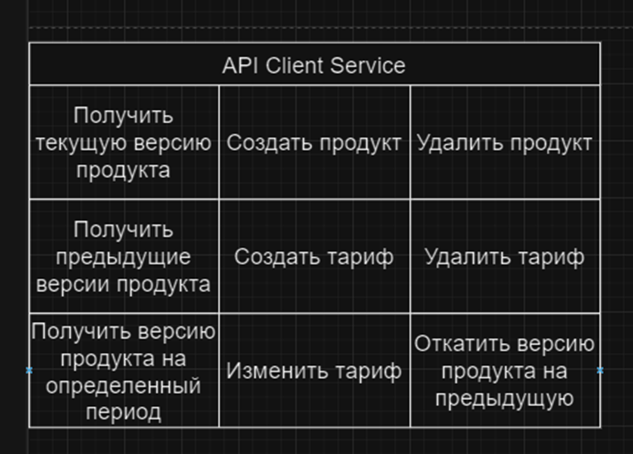

### Запуск приложения

- Требования Java 21, Maven 3.9.6, git, docker, docker-compose  
- Клонируйте проект командой git clone  
- [тестовое задание 2](https://github.com/dima-abc/tarifficator.git)  
- - Перейди в корень проекта и соберите проект командой:  
    <b> mvn -DskipTests package </b>  
- При помощи docker-compose.yaml разверните контейнер всех приложений  
    <b> docker-compose up -d </b>  
- 
# Перед началом работы зарегистрируйте пользователя и получите token доступа

## Сервис аутентификации
### Swagger
### [http://localhost:8086/swagger-ui/index.html](http://localhost:8086/swagger-ui/index.html)
### Основные ссылки
#### Работа с аутентификацией
создать пользователя POST [/users/signup](http://localhost:8086//users/signup)  
- body Json  
  {    
  "username":"User Name",  
  "password":"Password",  
  "firstname":"User",  
  "lastname":"Name",  
  "email":"userName@mail.ru"  
  }  
- body request  
  {  
  "username": "user2",  
  "email": "user2@test.ru",  
  "firstname": "John",  
  "lastname": "B",  
  "password": "password",  
  "statusCode": 201,  
  "statusMessage": "Created"  
  }   
получить токен доступа POST [/users/login](http://localhost:8086//users/login)  
- body Json  
  {  
  "username":"User name",  
  "password":"password"  
  }  
- body request  
  {  
  "accessToken": "token",  
  "refreshToken": "refresh_token",  
  "scope": "scopes_access",  
  "expiresIn": 300  
  }  
#### Полученный токен доступа необходима добавить в Authorization Bearer + accessToken
---

### Swagger

### [http://localhost:8084/swagger-ui/index.html](http://localhost:8084/swagger-ui/index.html)

### Основные ссылки

#### Работа с тарифами

создать POST [/api/v1/client/tariffs](http://localhost:8084/api/v1/client/tariffs)  
удалить DELETE [/api/v1/client/tariffs/{tariffId}](http://localhost:8084/api/v1/client/tariffs/{tariffId})  
обновить PATCH [/api/v1/client/tariffs/{tariffId}](http://localhost:8084/api/v1/client/tariffs/{tariffId})  

#### Работа с версиями продукта

откатить на предыдущую POST [/api/v1/client/products/version/{uuid}/revert](http://localhost:8084/api/v1/client/products/version/{uuid}/revert)  
получить предыдущие версии GET [/api/v1/client/products/version/{uuid}/previous](http://localhost:8084/api/v1/client/products/version/{uuid}/previous)  
получить версии за период GET requestParam start-period=yyyy-mm-dd HH:mm:ss&&end-period=yyyy-mm-dd HH:mm:ss  
[/api/v1/client/products/version/{uuid}/previous](http://localhost:8084/api/v1/client/products/version/{uuid}/previous)  

получить актуальную версию продукта GET [/api/v1/client/products/version/{uuid}/actual](http://localhost:8084/api/v1/client/products/version/{uuid}/actual)  

#### Работа с продуктом

создать продукт POST [/api/v1/client/products/](http://localhost:8084/api/v1/client/products/)
удалить проудкт DELETE [/api/v1/client/products/{productId}](http://localhost:8084/api/v1/client/products/{productId})

#### Работа с учетными записями

получить все GET [/api/v1/client/accounts](http://localhost:8084/api/v1/client/accounts)
создать POST [/api/v1/client/accounts](http://localhost:8084/api/v1/client/accounts)
посик по ID GET [/api/v1/client/accounts/{id}](http://localhost:8084/api/v1/client/accounts/{id})

### Задание

[СХЕМА ПРОЕКТА](https://app.diagrams.net/#HMVGrebenyuk%2FFS_Task%2Fmaster%2Ftask%2Fsrc%2Fmain%2Fresources%2F%D0%94%D0%B8%D0%B0%D0%B3%D1%80%D0%B0%D0%BC%D0%BC%D0%B0%20%D0%B1%D0%B5%D0%B7%20%D0%BD%D0%B0%D0%B7%D0%B2%D0%B0%D0%BD%D0%B8%D1%8F.drawio.png#%7B%22pageId%22%3A%22wj7Y0coOoXdOwT07gC3s%22%7D)

#### Необходимо написать 3 микросервиса,
- BackEnd client Service
- Products
- Tariffs
- Backend client service – является входной точкой в нашем приложение «Тарификатор».
- Микросервис Products – хранит в себе банковские продукты (кредиты, карты) с определенными тарифами на определенные даты.
- Микросервис Tariffs – это условные тарифы, которые являются составляющими продуктов, но хранятся в отдельном микросервисе.

#### Суть текущей части задания:

#### Backend Client Service должен реализовывать API:  

     

Products и Tariffs должны взаимодействовать между собой либо по ресту либо по JMS с использованием Kafka,  
тут – на твой выбор. Свой выбор нужно будет обосновать, почему выбрала такой способ, а не иной.  
Как видно из API, нужно будет поработать с версионностью.  

#### Условия:
- При изменении любого поля у продукта – версия продукта меняется
- При изменении любого поля у тарифа – версия тарифа меняется
- При изменении тарифа у продукта – версия продукта меняется
- Таблицы можно дополнять
- Можно создавать новые таблицы для доп.сущностей
- Версионность можно реализовать своими силами, либо с использованием Hibernate Envers (рекомендуется)
- Микросервис User – это тот МС, который был написан в предыдущем задании
- БД можно использовать общую для упрощения написания кода, но ходить в таблицы других сервисов нельзя (как будто, у нас полноценная микросервисная архитектура)
- По итогу все 4 мс + kafka (если нужно использовать) + postgres должны разворачиваться в 1 docker-compose

